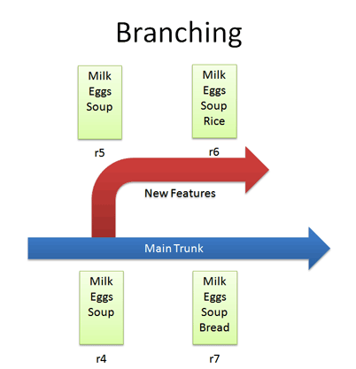

# T3A1 Workbook

## Submitted by: Wilson Esmundo

To view the Workbook in Github  
Please click [here](https://github.com/charliegucci/T3A1)

## Table of Contents

- [Provide an overview and description of a standard source control process for a large project](#Provide-an-overview-and-description-of-a-standard-source-control-process-for-a-large-project) 

- [What are the most important aspects of quality software](#What-are-the-most-important-aspects-of-quality-software) 

- [Outline a standard high level structure for a MERN stack application and explain the components](#Outline-a-standard-high-level-structure-for-a-MERN-stack-application-and-explain-the-components) 

- [A team is about to engage in a project, developing a website for a small business. What knowledge and skills would they need in order to develop the project](#A-team-is-about-to-engage-in-a-project-developing-a-website-for-a-small-business-What-knowledge-and-skills-would-they-need-in-order-to-develop-the-project) 

- [With reference to one of your own projects, discuss what knowledge or skills were required to complete your project, and to overcome challenges](#With-reference-to-one-of-your-own-projects-discuss-what-knowledge-or-skills-were-required-to-complete-your-project-and-to-overcome-challenges) 

- [With reference to one of your own projects, evaluate how effective your knowledge and skills were for this project, and suggest changes or improvements for future projects of a similar nature](#With-reference-to-one-of-your-own-projects-evaluate-how-effective-your-knowledge-and-skills-were-for-this-project-and-suggest-changes-or-improvements-for-future-projects-of-a-similar-nature) 

- [Explain control flow, using an example from the JavaScript programming language](#Explain-control-flow-using-an-example-from-the-JavaScript-programming-language) 

- [Explain type coercion, using examples from the JavaScript programming language](#Explain-type-coercion-using-examples-from-the-JavaScript-programming-language) 

## Provide an overview and description of a standard source control process for a large project

---

Version Control or Source Control lets you track your files over time. So when you mess up we can easily get back to a previous working version.
| # | Functions of Version Control |
| :------- | :-------------- |
| Backup and Restore | Files are saved as they are edited, and we can jump to any moment in time. |
| Synchronization | Lets people share files and stay up-to-date with the latest version.|
| Short-term undo | We can throw away changes and go back to the “last known good” version in the database.|
| Long-term undo | We can jump back to the old version, and see what change was made that day.|
| Track Changes | As files were updated, we can leave messages explaining why the change happened. This makes it easy to see how a file is evolving over time.|
| Track Ownership | We can track every changes with the name of the person who made it.|
| Sandboxing | We can make temporary changes in an isolated area, test and work out the kinks before “checking in” your changes.|
| Branching and merging | Its like a larger sandbox were we can branch a copy of your code into a separate area and modify it in isolation tracking changes separately. Later, you can merge your work back into the common area.|
 

| #                        | Basic Setup                                                                                             |
| :----------------------- | :------------------------------------------------------------------------------------------------------ |
| Repository (repo)        | The database storing the files.                                                                         |
| Server                   | The computer storing the repo.                                                                          |
| Client                   | The computer connecting to the repo.                                                                    |
| Working Set/Working Copy | Your local directory of files, where you make changes.                                                  |
| Trunk/Main               | The primary location for code in the repo. Think of code as a family tree — the trunk is the main line. |

 

### Examples:

#### Checkins

  
\*\*\* Each time we check in a new version, we get a new revision (r1, r2, r3, etc.)  

#### Checkouts And Editing

  
\*\*\* If you don’t like your changes and want to start over, you can revert to the previous version and start again (or stop). When checking out, you get the latest revision by default. If you want, you can specify a particular revision. 

#### Difference

  
\*\*\* The trunk has a history of changes as a file evolves. Diffs are the changes you made while editing: imagine you can “peel” them off and apply them to a file  

#### Branching

  
\*\*\* let us copy code into a separate folder so we can edit it separately. 

#### Merging

  
\*\*\* adds the changes we made from the branch to the main trunk 

#### Conflict

  
\*\*\* When changes overlap and contradict  

#### Tagging

  
\*\*\* lets us tag revision for easy references. 

## What are the most important aspects of quality software

---

The following aspect will measure the quality of a software but depends upon the projects on which part they can prioritize more.

| #                 | Important Aspect of Quality Software                                                                                                                                                                                                                                                                                                                                                     |
| :---------------- | :--------------------------------------------------------------------------------------------------------------------------------------------------------------------------------------------------------------------------------------------------------------------------------------------------------------------------------------------------------------------------------------- |
| Reliability       | Software will be considered reliable if it behaves consistently. The functionality of a program should be predictable and repeatable. Errors should occur rarely or not at all. Errors that do occur should be handled gracefully and proactively. Users should never ask themselves whether the software will work correctly.                                                           |
| Understandability | Code, its component and structure must be clear, understandable and well organized. They must behave the way a developer would expect. Anything in the code that causes developers confusion reveals that the code is lacking in understandability. High-quality source code always appears simple and obvious.                                                                          |
| Modifiability     | It should be easy to add or change the behavior of a system. Flexible systems require changing very few lines of code to alter a behavior. For the expected dimensions of change, an application should have plugin points that allow the application to be used with different contextual elements. Tight coupling to an element that is expected to change is absolutely unacceptable. |
| Usability         | Software products must be simple and easy to use. The common use cases should be as obvious and clearly presented as possible. Software should not require excessive configuration. Users should feel empowered by your software. They should not need internet searches to discover core application functionality.                                                                     |
| Testability       | The functionality of software must be verifiable. The process of testing the software must be easy. Each business use case should be directly testable. Clear verification metrics must be available. Highly testable software will ship with a comprehensive automated test suite.                                                                                                      |
| Portability       | Portable software is usable in different environments and contexts. It is highly reusable. Portable software is decoupled from specific operating systems, types of hardware, and deployment contexts. Extremely portable software is reusable across projects and problem domains.                                                                                                      |
| Efficiency        | Efficient software uses as few physical resources as possible. It is fast. It is memory-efficient. It consumes few CPU cycles. It uses little battery life. It makes few external service calls. It minimizes the number of database calls. Efficient software accomplishes as much as possible with the least amount of resources.                                                      |

 

## Outline a standard high level structure for a MERN stack application and explain the components

---

  

MERN stack is the combination of technologies used to create a web application. Any web application will be made using multiple technologies (frameworks, libraries, databases etc).

The main advantage for developers using the MERN stack is that every line of code is written in JavaScript. This is a programming language that’s used everywhere, both for client-side code and server-side code. With one language across tiers, there’s no need for context switching.

The MERN stack is a JavaScript stack that’s designed to make the development process smoother. MERN includes four open-source components: MongoDB, Express, React, and Node.js. These components provide an end-to-end framework for developers to work in. 

| #       | Components                                                                                                                                                                                                                                                                                                                                                                                                                                                                                                                                                                                                                                                               |
| :------ | :----------------------------------------------------------------------------------------------------------------------------------------------------------------------------------------------------------------------------------------------------------------------------------------------------------------------------------------------------------------------------------------------------------------------------------------------------------------------------------------------------------------------------------------------------------------------------------------------------------------------------------------------------------------------- |
| MongoDB | A cross-platform document database. It is a NoSQL (non-relational) document-oriented database. While conventional relational databases have a typical schema design based on columns and tables, MongoDB is schema-less. Data is stored in flexible documents with a JSON (JavaScript Object Notation)-based query language. The content, size, and number of fields in the documents can differ from one to the next. This means that the data structure to be changed over time.                                                                                                                                                                                       |
| Express | A back-end web application framework. It is a web application framework for Node.js, another MERN component. Instead of writing full web server code by hand on Node.js directly, developers use Express to simplify the task of writing server code. There’s no need to repeat the same code over and over, as you would with the Node.js HTTP module. The Express framework is designed for building robust web applications and APIs. It’s known for its fast speed and minimalist structure, with many features available as plugins.                                                                                                                                |
| React   | A JavaScript library for building user interfaces. It was originally created by a software engineer at Facebook, and was later open-sourced. It is maintained by Facebook, as well as a community of development companies and individual developers. Its library can be used for creating views rendered in HTML. React views are declarative. This means that developers don’t have to worry about managing the effects of changes in the view’s state or changes in the data. Instead of relying on templates to automate the creation of repetitive HTML or DOM elements, React uses a full-featured Javascript to construct repetitive or conditional DOM elements. |
| Node.js | A cross-platform JavaScript runtime environment. It was initially built for Google Chrome, and later open-sourced by Google in 2008. It is built on Chrome’s V8 JavaScript engine. It’s designed to build scalable network applications, and can execute JavaScript code outside of a browser. Node.js works without an enclosing HTML page, instead using its own module system based on CommonJS, to put together multiple JavaScript files.                                                                                                                                                                                                                           |

 

## A team is about to engage in a project, developing a website for a small business. What knowledge and skills would they need in order to develop the project

---

| #                                                             | Skills / Knowledge to develop a Website                                                                                                                                                                                                                                                                                                                                                                                                                                                                                                                                                                                                                                                                                                                                                    |
| :------------------------------------------------------------ | :----------------------------------------------------------------------------------------------------------------------------------------------------------------------------------------------------------------------------------------------------------------------------------------------------------------------------------------------------------------------------------------------------------------------------------------------------------------------------------------------------------------------------------------------------------------------------------------------------------------------------------------------------------------------------------------------------------------------------------------------------------------------------------------- |
| Programming                                                   | There are many languages exist for different aims, but you need to know at least a few of them to be able to code a website. One of them is HTML which is the standardized markup language to create documents on the web, in other words to format the content on the webpage. Another is CSS, which means Cascading Style Sheets, is a language paired with HTML to allow a programmer to set the webpage style. Here we mean layout, colors, and fonts. These elements are kept separate from the main webpage code. For functionality, JavaScript is the solution for animation, games, apps, and interactivity on a website. All dynamic effects on a site are created via this programming language.                                                                                 |
| Learning                                                      | People who deal with technologies, innovations, and web development should understand how critical it is to keep their finger on the pulse regarding novelties. Web developers will be of interest for potential employers when he knows a lot, can create whatever website or application, is able to fix bugs, can be unique and creative.                                                                                                                                                                                                                                                                                                                                                                                                                                               |
| Testing                                                       | It is a big part of the website development process, which is not only coding and design alone. It would be good to test final product to your client and make sure everything is done properly such as compatibility issues with browsers, direct links, forms, navigation menu, pages load fast, etc.                                                                                                                                                                                                                                                                                                                                                                                                                                                                                    |
| Basic Knowledge of Design                                     | A developer is not the same as a designer, but design skills are useful and helpful to developers in their everyday work, and awareness of development is helpful for a designer. Developers should learn a bit of graphic design, because this can bring him a good awareness of many graphic tools which are useful for better development. When developers learn design techniques, they get a better understanding of website appeal and acquire better design taste. Taste is essential for every creative artist. They usually work on the same project, but on different aspects of it. This is great when they understand each other and can collaborate and of course sharing knowledge and experience helps with this. Professional recommendation is a good source of learning. |
| SEO                                                           | The first factor which reflects on SEO is time, or speed. Developers deal with this the most, so they should understand the crucial importance of website speed for SEO tactics. This factor depends on a developer’s job, and particularly on which programming languages they use. To add some more facts to consider: Meta tags and titles, subdomains, internal linking, sitemap are all key components of SEO. Developers have to be aware of the proper redirect ways.                                                                                                                                                                                                                                                                                                               |
| Understanding Common Security Attacks and How to Prevent Them | Web development is a many-sided profession: programmer, tester, designer and a security provider. Security skills are indispensable when creating a website. You need to be ready for any security attack and know how to provide a safe solution for it. Attacks such as SQL injection, Cross-site scripting, handling error messages                                                                                                                                                                                                                                                                                                                                                                                                                                                     |
| Image Resizing and Effects                                    | In most cases developers rely on designers for working with images. But basic knowledge of Photoshop and a few more programs can become a helpful skill. So the very minimum is: a developer of a website should be able to resize or crop an image, customize the colors, apply some effects like transparency.                                                                                                                                                                                                                                                                                                                                                                                                                                                                           |
| Resoluteness                                                  | Experience makes us better and new trials or even mistakes give us this experience. Developers do not have a right to doubt, he should try new things all the time to gain a better result, and develop with a new power. This is more like a human trait, not a skill, but you can’t become a developer without this.                                                                                                                                                                                                                                                                                                                                                                                                                                                                     |
| Confidence                                                    | Confidence in what you are doing can help you to save time and spend it on something more important than millions of tests. Because when you are not sure of the quality of your work, you will check it again and again until your time for this project finishes. This is not just about the time, but emotional and professional feel.                                                                                                                                                                                                                                                                                                                                                                                                                                                  |
| Frustration Tolerance and Patience                            | Website development can’t be perfect from your very first trial, if only you were a zero-bug developer. It would be amazing to know you are! Testing actually aims to make software bug-free, but we are talking more about the case when you are the only person working on the code, and testing is what you do alone. Patience is a very important feature that a good developer should have. You need to treat mistakes as something which leads you to perfection.                                                                                                                                                                                                                                                                                                                    |
| Time Management and Detailed Planning                         | Planning plays a vital role in time management such as setting long-term goals as well as short-term, planning tasks in detail to avoid re-planning, making a to-do list to follow each day, don’t shelve difficult tasks, break them into smaller pieces and do them straightaway, discipline yourself, make your working hours consistent and include time for rest in your schedule.                                                                                                                                                                                                                                                                                                                                                                                                    |

## With reference to one of your own projects, discuss what knowledge or skills were required to complete your project, and to overcome challenges

---

In relation to my last rails project (marketplace app), listed below were the knowledge or skills required and challenges encountered; 

| Knowledge / Skills           | Description                                                                                                                                                                                                                                                                                                                                                                                                                                         |
| :--------------------------- | :-------------------------------------------------------------------------------------------------------------------------------------------------------------------------------------------------------------------------------------------------------------------------------------------------------------------------------------------------------------------------------------------------------------------------------------------------- |
| Programming                  | As part of the requirement, we need to create the application using Ruby on Rails. Upon learning Ruby on the first term, it helps to learn the basics for the MVC framework such as Ruby on Rails. Also learning HTML and CSS in term 1 contributes in designing and styling the Client-side of the application.                                                                                                                                    |
| Learning                     | Before or as you build the project, you will encounter some ideas that you want to implement in the application. Most of the time, these will include a lot of reading documentations and even watching tutorials on how it works. Some of these concept were not taught in school so you need to do a lot of research.                                                                                                                             |
| Testing                      | As we build along the project, we make sure that we test the application after every feature we implement. This include testing on both development and production. By doing that, it helps us narrow down the source of errors or bugs if theres any.                                                                                                                                                                                              |
| Design                       | By learning HTML and CSS on the first term, we managed to implement some knowledge and techniques to our design. The use of wireframes and mood boards helps us layout the basic design and build up as we go along. Learning CSS libraries such as Bootstrap and Bulma contributes well for the overall user experience.                                                                                                                           |
| Time Management and Planning | Whether you’re in school learning or at work for a company, we need to stay on top of your schedule and your projects This can mean getting to know productivity apps like task lists or calendars or, especially if you’re in a large organization. We've used project tracking tools like Trello to keep track on the development of the project. Whatever the tools, mastering the art of prioritizing and tracking your work will be essential. |

 

| Challenges Encountered | How we overcome                                                                                                                                                                                                                                                                                                                                                                                                                                                                                                                                                             |
| :--------------------- | :-------------------------------------------------------------------------------------------------------------------------------------------------------------------------------------------------------------------------------------------------------------------------------------------------------------------------------------------------------------------------------------------------------------------------------------------------------------------------------------------------------------------------------------------------------------------------- |
| Time Limitation        | Software development is a time-game. We work under pressured environments and strive to complete project requirements within strict timelines. We used Trello and Canban methodology to keep track and prioritized the implementation of the application.                                                                                                                                                                                                                                                                                                                   |
| User-friendly Design   | It is important for the web developers to create a sophisticated software with comprehensive coding so that it doesn’t lag behind in the race of the most advanced application available on the Internet. End users will not appreciate your website for its intricate coding, or the exquisite software that you use. The only thing your user will remember you for is how user-friendly your website is and how easy navigation is on your portal. We tried to have some User Testing from our cohorts and educators so they can give feedbacks for the user experience. |
 

## With reference to one of your own projects, evaluate how effective your knowledge and skills were for this project, and suggest changes or improvements for future projects of a similar nature

---
If given chance to redo everything, il will consider;
| Steps | Changes |
| :------- | :-------------- |
| Reevaluate | I get it, creating a project isn’t as easy as it sounds specially with the limited resources you have. Improving a project takes planning, and the process can take weeks but since you already have idea what to do it could lessen the time. To help ease the rebuilding a project, it will be great if we work in teams so we could collaborate more and we could take the time to learn as much as we can about the team’s opinions of the project and of each other.|
| Figure out the failures | Sometimes when we plan the project we struggle to find out the complexity of the project. We tend to add all the features that we think is good but in the end we figured out that they don't worked or not compatible with each other. People learn from experience so the next time we encounter it we know what to do.|
 
I could say that with reference to my projects they were satisfactory for me and probably for others and the skills and knowledge that I acquired while studying equipped me on how to proceed. 

## Explain control flow, using an example from the JavaScript programming language

---
Most of our code involves control flow in which often times we want our program to act differently based on the information supplied to it. In Javascript it uses control flow like any other languages, we just need to understand and be able to use different operators and how to use them. 

| Operators | Description | Example |
| :------- | :--------------: | :---:|
|Undefined and Null | You will get undefined when you are looking for something that does not exist like a variable that does not have a value yet. Undefined simply means what you are asking for does not exist while null is an object that we, the developers, set when we want to tell other developers that the item they are looking for exists, but there is no value associated with it.|  |
| Truthiness | The Boolean values, true and false. When using an if statement or other statements that expect a Boolean value (such as the !, NOT), and the expression given is not a Boolean value, JavaScript will do something called type coercion and transform whatever it is given into a Boolean value. This is known as truthy and falsey. Every data type has a truthiness to it. | |
| Comparison Operators | These operators work just as they would in a math class: greater than, less than, and etc. We use these operators to evaluate two expressions. The “triple equals” sign ( === ) must not be confused with a single equal sign (which indicates assigning a value to a variable). The triple equal will compare everything about the two items, including type, and return if they are exactly equal or not. The “NOT” (!) means that we are asking the opposite of the expression. The “not equals” ( !== ) sign returns true if the items are NOT equal to each other.|   |
| Logical Operators | The first logical operator we will look at is the “AND” operator. It is written with two ampersands (&&). This will evaluate both expressions and will return true if BOTH expressions are true. If one (or both) of them is false, then this operator will return false. The next is the “OR” operator. It is written with two vertical bars. It will determine if one of the expressions is true. It will return true if one (or both) of the expressions is true. It will return false if BOTH expressions are false. The last logical operator is the “NOT” operator. It is written as a single exclamation mark (!). We saw this operator earlier when determining equality (!==). As before, the NOT operator will return the opposite Boolean value of what is passed to it.|    |
| If Operator | We can use if to check and see if an expression is true. If it is, run some code. If it is not, skip the code and keep running the program. |  |
| If / Else if / Else | These statements must be used with if and must come after it. These statements will be evaluated if the initial if returns false. We can think of the else if as another if statement that has been chained (we can have as many else if statements we want). The else statement will always come at the end of an if-else if chain, and will act as a default. If none of the expressions returned true, the else code block will be run no matter what. If any of the previous if or else if expressions are true, the else statement code block will not be run. |   |

## Explain type coercion, using examples from the JavaScript programming language

---
### Type Coercion

Type Coercion is the process of converting value from one type to another (such as string to number, object to boolean, and so on). Any type, be it primitive or an object, is a valid subject for type coercion. To understand how basic type coercion works in JavaScript you can open up your console and simply type "5" == 5 . The JavaScript engine will return true for this case. This will not be possible in a strongly typed language. In plain words, the JavaScript engine is implicitly changing string type "5" to numeric type value 5 and checking with equality operator. However, on trying "5" === 5 with strict equality operator will return false. There is no implicit type coercion happening in this case. The difference between == and === is usually characterized that == checks for value equality and === checks for both value and type equality.  

 

| Types of Coercion | Description | Example |
| :------- | :--------------: | :---:|
| Explicit or ‘Type casting’ | happens when the programmer explicitly converts type of value to a desired type. |  |
| Implicit | are the type conversions which are hidden. JavaScript being the weakly-typed language, values can be converted between different types ‘implicitly’. |  |
 

| Types of Conversion | Description | Example |
| :------- | :--------------: | :---:|
| String conversion | toString() can also be used to convert any type to string, however, as explicit as it might seem from the code, it is very much implicit in nature. Reason being it cannot be directly used on primitive value like 1234 or Boolean true. So, a type variable being an object wrapper will invoke toString() method. |    |
| Numeric conversion | Number(..) function coerces to any other type value to a primitivenumber value. Another way of explicitly coercion is using unary operator + where it explicitly coerces its operand (c) to a numbervalue.|   |
| Boolean conversion | To explicitly convert a value to a boolean type Boolean(..) function can be used. Just like the unary + operator coerces a value to a number the unary ! negate operator explicitly coerces a value to a boolean. ! operator explicitly inverses the truthy to falsy and vice versa. Any value used in these contexts that is not already a boolean will first be implicitly coerced to a boolean. Both Or and And operators perform a boolean test on the first operand (a or c). For the OR operator, if the test is true, the OR expression results in the value of the first operand (a or c). If the test is false, the OR expression results in the value of the second operand (b). Inversely, for the && operator, if the test is true, the && expression results in the value of the second operand (b). If the test is false, the && expression results in the value of the first operand (a or c). This test returns the first falsy value. | Explicit      Implicit    |

## Reference

---

A Visual Guide to Version Control, Better Explained , https://betterexplained.com/articles/a-visual-guide-to-version-control/  

The Seven Aspects of Software Quality, Silas Reinagel, https://www.silasreinagel.com/blog/2016/11/15/the-seven-aspects-of-software-quality/  

Everything You Need to Know about the MERN Stack, Hyperion Development, https://blog.hyperiondev.com/index.php/2018/09/10/everything-need-know-mern-stack/  

12 Skills You Need to Develop a Website, Julia Blake, https://onextrapixel.com/12-skills-you-need-to-develop-a-website/  

Introduction to JavaScript: Control Flow, Mahendra Choudhary, https://medium.com/javascript-in-plain-english/introduction-to-javascript-control-flow-6272f92b75fa  

Intro to Type Coercion in JavaScript, Abid Rahim, https://medium.com/@abid.rahim1/intro-to-type-coercion-in-javascript-5b9a397c1e95  

