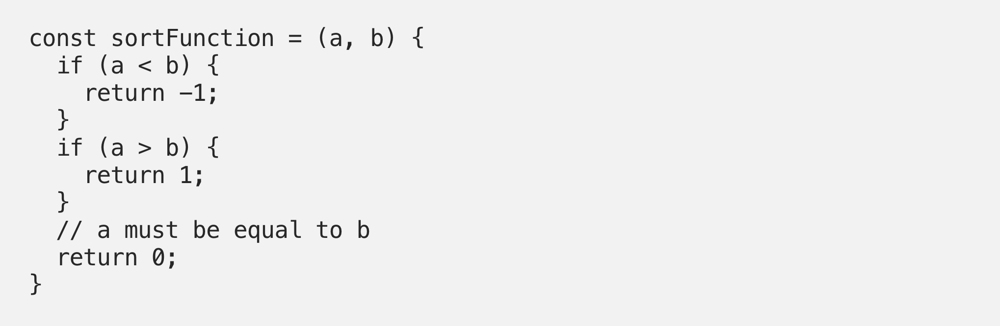

# T3A1 Workbook

## Submitted by: Wilson Esmundo

To view the T3A1 Workbook in Github <br/>
Please click [here](https://github.com/charliegucci/T3A1)

## Table of Contents

- [Provide an overview and description of a standard source control process for a large project](#Provide-an-overview-and-description-of-a-standard-source-control-process-for-a-large-project)<br/>

- [What are the most important aspects of quality software](#What-are-the-most-important-aspects-of-quality-software)<br/>

- [Outline a standard high level structure for a MERN stack application and explain the components](#Outline-a-standard-high-level-structure-for-a-MERN-stack-application-and-explain-the-components)<br/>

- [A team is about to engage in a project, developing a website for a small business. What knowledge and skills would they need in order to develop the project](#A-team-is-about-to-engage-in-a-project-developing-a-website-for-a-small-business-What-knowledge-and-skills-would-they-need-in-order-to-develop-the-project)<br/>

- [With reference to one of your own projects, discuss what knowledge or skills were required to complete your project, and to overcome challenges](#With-reference-to-one-of-your-own-projects-discuss-what-knowledge-or-skills-were-required-to-complete-your-project-and-to-overcome-challenges)<br/>

- [With reference to one of your own projects, evaluate how effective your knowledge and skills were for this project, and suggest changes or improvements for future projects of a similar nature](#With-reference-to-one-of-your-own-projects-evaluate-how-effective-your-knowledge-and-skills-were-for-this-project-and-suggest-changes-or-improvements-for-future-projects-of-a-similar-nature)<br/>

- [Explain control flow, using an example from the JavaScript programming language](#Explain-control-flow-using-an-example-from-the-JavaScript-programming-language)<br/>

- [Explain type coercion, using examples from the JavaScript programming language](#Explain-type-coercion-using-examples-from-the-JavaScript-programming-language)<br/>

- [Explain data types, using examples from the JavaScript programming language](#Explain-data-types-using-examples-from-the-JavaScript-programming-language)<br/>

- [Explain how arrays can be manipulated in JavaScript, using examples from the JavaScript programming language](#Explain-how-arrays-can-be-manipulated-in-JavaScript-using-examples-from-the-JavaScript-programming-language)<br/>

- [Explain how objects can be manipulated in JavaScript, using examples from the JavaScript programming language](#Explain-how-objects-can-be-manipulated-in-JavaScript-using-examples-from-the-JavaScript-programming-language)<br/>

- [Explain how JSON can be manipulated in JavaScript, using examples from the JavaScript programming language](#Explain-how-JSON-can-be-manipulated-in-JavaScript-using-examples-from-the-JavaScript-programming-language)<br/>

- [For the code snippet provided below, write comments for each line of code to explain its functionality. In your comments you must demonstrates your ability to recognise and identify functions, ranges and classes](#For-the-code-snippet-provided-below-write-comments-for-each-line-of-code-to-explain-its-functionality-In-your-comments-you-must-demonstrates-your-ability-to-recognise-and-identify-functions-ranges-and-classes)<br/>

## Provide an overview and description of a standard source control process for a large project

---

Let say you want to check source code or files from start to finish, Version Control or Source control is a tool most projects used. It functions as a time machine in which you can go back from history to present.
| # | Functions of Version Control(Source Control) |
| :------- | :-------------- |
| Backup and Restore | All your work will be saved, edited and can be restored in the beginning up to the recent changes. |
| Synchronization | People working in the project can collaborate with source codes and will let them update to the current one.|
| Short-term undo | If we made any errors and don't know how to fixed it, we can just disregard the changes and go back to the last known working state.|
| Long-term undo | If theres already a lot of source code written and let say they have tag with versions, We can go over it and check the logs for that tag.|
| Track Changes | Any changes we made, let say adding, removing, updating or deleting files, we can comment message for that certain change or changes making it easy for yourself or others when you go back and had a look on how your work had developed overtime.|
| Track Ownership | All the changes that you've made will be reflected under however made those revisions so everyone working on that file will know whoever is responsible. |
| Sandboxing | Basically, you can test whatever you want to change before committing and deploying your changes.|
| Branching and merging | This provides us an option for our code to be modular. We can segregate major changes, test it before we merge it back to the working state.|
<br>

| #                        | Basic Setup                                                  |
| :----------------------- | :----------------------------------------------------------- |
| Repository (repo)        | This will be your online database thats stores your code.    |
| Server                   | This will be your local machine which stores the repository. |
| Client                   | This will be your computer connecting to the repository.     |
| Working Set/Working Copy | This will be your local files where you made changes.        |
| Trunk/Main               | This will be the main line for your code in the repository.  |

<br>

### Examples:

#### Checkins

 <br/>
\*\*\* In this example, each time we made a change or add something to a code, it provides references <br>

#### Checkouts And Editing

 <br/>
\*\*\* In this example, everthing time you check in youl be given the recent version of the code and can go back to previous ones.<br/>

#### Difference

 <br/>
\*\*\* In this example, we can see the difference between every stages weve made.<br/>

#### Branching

 <br/>
\*\*\* In this example, we can sandbox any changes we want to implement before adding it to the working state.<br/>

#### Merging

 <br/>
\*\*\* In this, example after making those changes in the branch, we added those changes in the main one.<br/>

#### Conflict

 <br/>
\*\*\* In this example, we can see two those changes which is different and gives conflict on which is right or wrong before merging to the main state<br/>

#### Tagging

 <br/>
\*\*\* In this example, we can tag changes so that it will be easier to reference.<br>

## What are the most important aspects of quality software

---

The following are aspects in measuring the quality of a software:

| Aspect of Quality Software | Description                                                                                                                                                                                                                                                                           |
| :------------------------- | :------------------------------------------------------------------------------------------------------------------------------------------------------------------------------------------------------------------------------------------------------------------------------------ |
| Reliability                | A reliable software should be consistent and plenty software testing is imperative prior to deployment to minimise errors. There is no such thing as a zero-bug software however a reliable software should have very few faults and these faults should be fixed in a timely manner. |
| Understandability          | A software developer must exercise clear, highly organised and logical structured code. It is difficult to manage a software if it is poorly written. It also affects the effectivity and efficiency during bug-fixing and testing if code is not done in an organised way.           |
| Modifiability              | Similar to understandability, if a software is well-organised, it is easy to make modifications. It should be flexible and any changes to be done should be also be easy to deploy when done.                                                                                         |
| Usability                  | One of the purposes of a software development is to meet specific needs of a client. This can be achieved when a software is effective, and it can only be effective if the user is comfortable using the software after a short training.                                            |
| Testability                | Testability – Quality of a software depends on testability. If the errors are found and corrected prior deployment, the software becomes reliable. Testing saves time, effort and costs.                                                                                              |
| Portability                | A software should be able to work in multiple environments and can be transferred to another environment and still work properly with small changes.                                                                                                                                  |
| Efficiency                 | An efficient software should use very little physical resources as can possibly get but still perform a function as required.                                                                                                                                                         |

<br/>

## Outline a standard high level structure for a MERN stack application and explain the components

---

 <br/>

MERN stack is one of the JavaScript web app stacks that is being used in creating web applications. Its main purpose is to create effective, efficient, fast and flexible web applications by putting together these four components – MongoDB, Express, React and Node.js.<br/>

| Components | Description                                                                                                                                                                                                                                                     |
| :--------- | :-------------------------------------------------------------------------------------------------------------------------------------------------------------------------------------------------------------------------------------------------------------- |
| MongoDB    | Compared to other database, MongoDB is a document database which is non relational (NOSQL) and doesn't use schema formats like tables and columns. The data format of the document is query through Javascript Object Notation (JSON).                          |
| Express    | A back-end or server side framework. Its considered web application framework for Node. It simplifies the task of writing server side codes. Known for its speed and minimalist structure, which features many available plugins which will make your code DRY. |
| React      | It is one of javaScript libraries for client side interface. It was created by Facebook. Its library is used for creating views in HTML. React views are declarative which automate the creation of repetitive HTML or DOM elements.                            |
| Node.js    | A cross-platform JavaScript runtime environment which is built on Chrome’s V8 JavaScript engine. It is designed to run Javascript code with multiple files.                                                                                                     |

<br/>

## A team is about to engage in a project, developing a website for a small business. What knowledge and skills would they need in order to develop the project

---

| #                                                             | Skills / Knowledge to develop a Website                                                                                                                                                                                                                                                                                                                                                                                                                                                                                     |
| :------------------------------------------------------------ | :-------------------------------------------------------------------------------------------------------------------------------------------------------------------------------------------------------------------------------------------------------------------------------------------------------------------------------------------------------------------------------------------------------------------------------------------------------------------------------------------------------------------------- |
| Programming                                                   | there are plenty of programming languages available and they are created for different purposes. HTML, CSS and JavaScript are the three most popular. HTML is short for Hypertext Markup Language, it is used in creating pages in web browser. Contents and links that can be viewed in the web pages are done using HTML. CSS means Cascading Style Sheets, this allows programmer to create style on pages. Colours, fonts and layout that we view in web pages are done using CSS. JavaScript on the other hand is .... |
| Learning                                                      | Web developers should not only know how about programming languages but also knowledgeable about the project. It is important that the programmer is aware of the purpose why there is a project and able to meet expectations.                                                                                                                                                                                                                                                                                             |
| Testing                                                       | Testing during the development phase and prior to delivering the final product are equally both important. This is to save time, money and make sure everything is working fine to satisfy customer requirements.                                                                                                                                                                                                                                                                                                           |
| Basic Knowledge of Design                                     | A developer should have basic understanding in graphic design or using graphic tools. This assists the developer into building the website as to what the customer desires.                                                                                                                                                                                                                                                                                                                                                 |
| SEO                                                           | It is important for a developer to have understanding on how search engines work. As the team is developing a website for a small business, it is vital for the business to have online presence and increase customers.                                                                                                                                                                                                                                                                                                    |
| Understanding Common Security Attacks and How to Prevent Them | Protecting website from Cybersecurity attacks are essential. Any website developer should have a basic understanding of different types and how to prevent as such. These could pose serious threats to businesses if not considered at time of web development.                                                                                                                                                                                                                                                            |
| Image Resizing and Effects                                    | A website developer should be familiar in using Photoshop or related graphics editor. In this day and age, customers are more inclined into visually minded web pages.                                                                                                                                                                                                                                                                                                                                                      |
| Resoluteness                                                  | Resoluteness is a character of a person rather than a skill. It takes an adequate of determination to learn from mistakes, fixing the problem and finishing a task.                                                                                                                                                                                                                                                                                                                                                         |
| Confidence                                                    | A website developer should stay focused on his task and believe in one’s self that it can be done.                                                                                                                                                                                                                                                                                                                                                                                                                          |
| Frustration Tolerance and Patience                            | When working on a project, there are plenty of testing that needs to be done. It is important that the developer does not give up when faced with trials.                                                                                                                                                                                                                                                                                                                                                                   |
| Time Management and Detailed Planning                         | It very important for the team to do lots of planning when working on a project. A project management software or applications can be used to delegate tasks, managing hours and tracking progress.                                                                                                                                                                                                                                                                                                                         |

## With reference to one of your own projects, discuss what knowledge or skills were required to complete your project, and to overcome challenges

---

In relation to my last rails project (marketplace app), listed below were the knowledge or skills required and challenges encountered;<br/>

| Knowledge / Skills           | Description                                                                                                                                                                                                                                                                                                                                                                                                                                         |
| :--------------------------- | :-------------------------------------------------------------------------------------------------------------------------------------------------------------------------------------------------------------------------------------------------------------------------------------------------------------------------------------------------------------------------------------------------------------------------------------------------- |
| Programming                  | As part of the requirement, we need to create the application using Ruby on Rails. Upon learning Ruby on the first term, it helps to learn the basics for the MVC framework such as Ruby on Rails. Also learning HTML and CSS in term 1 contributes in designing and styling the Client-side of the application.                                                                                                                                    |
| Learning                     | Before or as you build the project, you will encounter some ideas that you want to implement in the application. Most of the time, these will include a lot of reading documentations and even watching tutorials on how it works. Some of these concept were not taught in school so you need to do a lot of research.                                                                                                                             |
| Testing                      | As we build along the project, we make sure that we test the application after every feature we implement. This include testing on both development and production. By doing that, it helps us narrow down the source of errors or bugs if theres any.                                                                                                                                                                                              |
| Design                       | By learning HTML and CSS on the first term, we managed to implement some knowledge and techniques to our design. The use of wireframes and mood boards helps us layout the basic design and build up as we go along. Learning CSS libraries such as Bootstrap and Bulma contributes well for the overall user experience.                                                                                                                           |
| Time Management and Planning | Whether you’re in school learning or at work for a company, we need to stay on top of your schedule and your projects This can mean getting to know productivity apps like task lists or calendars or, especially if you’re in a large organization. We've used project tracking tools like Trello to keep track on the development of the project. Whatever the tools, mastering the art of prioritizing and tracking your work will be essential. |

<br/>

| Challenges Encountered | How we overcome                                                                                                                                                                                                                                                                                                                                             |
| :--------------------- | :---------------------------------------------------------------------------------------------------------------------------------------------------------------------------------------------------------------------------------------------------------------------------------------------------------------------------------------------------------- |
| Time Limitation        | Delivering a project in a very short period of time was challenging. Judgment and emotions affect decision making when working under pressure. Using Trello and Canban methodology, we were able to manage our time and tasks.                                                                                                                              |
| User-friendly Design   | End users of the project does not have understandings of how the website was done or what programming languages were used. They are more concerned of what the web pages will look like, how appealing it is and how easy it is to navigate. Usability can be perspective. We asked our educators and associates to test the website and get some feedback. |

<br/>

## With reference to one of your own projects, evaluate how effective your knowledge and skills were for this project, and suggest changes or improvements for future projects of a similar nature

---

If given chance to redo everything, il will consider;
| Steps | Changes |
| :------- | :-------------- |
| Reevaluate | Using my knowledge in software development, learning new skills and plenty of testing, I was able to finish the project. In future projects, it will be great to work in teams so we can collaborate, share the load and increase efficiency.|
| Figure out the failures | Creating a project and learning new things can be quite exciting. During planning, I was inclined to add plenty of features not realising how complicated it can be and that it took much of my time trying to figure out how to do it. In future projects, I would still want to add a feature or two that I know the end user will appreciate, to challenge myself but also make sure that it can be done within the time-frame.|
<br/>
I could say that with reference to my projects they were satisfactory for me and probably for others and the skills and knowledge that I acquired while studying equipped me on how to proceed.<br/>

## Explain control flow, using an example from the JavaScript programming language

---

Most of our code involves control flow in which often times we want our program to act differently based on the information supplied to it. In Javascript it uses control flow like any other languages, we just need to understand and be able to use different operators and how to use them.<br/>

| Operators            |                                                                                                                                                                                                                                                                                            Description                                                                                                                                                                                                                                                                                             |                                           Example                                            |
| :------------------- | :------------------------------------------------------------------------------------------------------------------------------------------------------------------------------------------------------------------------------------------------------------------------------------------------------------------------------------------------------------------------------------------------------------------------------------------------------------------------------------------------------------------------------------------------------------------------------------------------: | :------------------------------------------------------------------------------------------: |
| Undefined and Null   |                                                                                                                                                                              Whenever you are looking for something that does not exist like a variable which has no value yet then you'll get undefined. Null is an object that we can use to tell others that the item exists, but there is no value at the moment.                                                                                                                                                                              |                                        |
| Truthiness           |                                                                                                                                                                                                   It gives us a true or false value when we use an if or other statements otherwise Javascript will perform type coercion and will transform it to Boolean value which will be truthy or falsey.                                                                                                                                                                                                   |                                                                      |
| Comparison Operators |                                                                                                                                                                                          The triple equal sign(===) compares everything about two items which includes its type and value. The not equal which is represented by adding exclamation symbol (!==) does the opposite of equality operator.                                                                                                                                                                                           |    |
| Logical Operators    |                             The AND which is composed with two ampersands && assesses the two articulations and returns valid if the two articulations are valid. Otherwise, if one or both of them is false it will return false. The OR is composed with two vertical bar checks on the off chance that one of the articulations is valid. It will return valid in the event that one or both of the articulations is valid. It will return false if BOTH articulations are false. Lastly, the NOT operator returns the opposite Boolean value you've passed to it.                              |                                    |
| If Operator          |                                                                                                                                                                                                                            If operators check if the statement we pass is true then proceed to executing some functions otherwise skips the code and do something else.                                                                                                                                                                                                                            |                                                                            |
| If,Else if, Else     | These statements must be used with if and must come after it. These statements are going to be evaluated if the initial if returns false. we are able to consider the else if as another if statement that has been chained and we can have as many else if statements we want. The else statement will always come at the tip of an if-else if chain, and can act as a default. If none of the expressions returned true, the else code block is going to be run regardless of what. If any of the previous if alternatively if expressions are true, the else statement code block won't be run. |                                  |

## Explain type coercion, using examples from the JavaScript programming language

---

### Type Coercion

Type Coercion is that the process of converting type of value from one type to a different like string to boolean, object to boolean, and so on. Any type, be it primitive or an object, could be a valid subject for type coercion. <br/>

<br/>

| Types of Coercion          |                                                                            Description                                                                            |            Example             |
| :------------------------- | :---------------------------------------------------------------------------------------------------------------------------------------------------------------: | :----------------------------: |
| Explicit or ‘Type casting’ |                                   This happens when the programmer explicitly converts the kind of value to the required type.                                    |  |
| Implicit                   | They are the sort of conversions that are hidden. JavaScript being the weakly-typed language, values are often converted between differing types of ‘implicitly’. |  |

<br/>

| Types of Conversion |                                                                                                                                                                                                                                                                                                                                                                                                                                                                              Description                                                                                                                                                                                                                                                                                                                                                                                                                                                                               |                                                              Example                                                              |
| :------------------ | :--------------------------------------------------------------------------------------------------------------------------------------------------------------------------------------------------------------------------------------------------------------------------------------------------------------------------------------------------------------------------------------------------------------------------------------------------------------------------------------------------------------------------------------------------------------------------------------------------------------------------------------------------------------------------------------------------------------------------------------------------------------------------------------------------------------------------------------------------------------------------------------------------------------------------------------------------------------------: | :-------------------------------------------------------------------------------------------------------------------------------: |
| String conversion   |                                                                                                                                                                                                                                                                                                              The toString() may also be accustomed convert any type to string, however, as explicit because it might sound from the code, it's much underlying nature. the explanation being it can not be directly used on primitive values like numbers or Boolean true. So, a kind variable being an object wrapper will invoke the toString() method.                                                                                                                                                                                                                                                                                                              |                                           |
| Numeric conversion  |                                                                                                                                                                                                                                                                                                                                                                         The Number(..) function coerces to the other type value to a primitive number value. in a different way of explicit coercion is by using unary operator + where it explicitly coerces its operand (i) to number value.                                                                                                                                                                                                                                                                                                                                                                         |                                       |
| Boolean conversion  | To explicitly convert the value to a boolean type Boolean(..) function is used. a bit like the unary + operator coerces a worth to variety the unary !== operator explicitly coerces a worth to a boolean. '!' operator explicitly inverses the truthy to falsy and the other way around. Any value utilized in these contexts that's not already a boolean will first be implicitly coerced to a boolean. Both Or and And operators perform a boolean test on the primary operand (a or c). For the OR operator, if the test is true, the OR expression ends up in the value of the primary operand (a or c). If the test is fake, the OR expression ends up in the value of the second operand (b). Inversely, for the && operator, if the test is true, the && expression ends up in the value of the second operand (b). If the test not true, the AND expression ends up in the value of the primary operand (a or c). This test returns the primary falsy value. | Explicit <br/>  <br/> Implicit <br/>  | <br/> |

## Explain data types, using examples from the JavaScript programming language

---

| Data Types | Description                                                                                                                                                                                                                                                                                                                                                                                                           |
| :--------- | :-------------------------------------------------------------------------------------------------------------------------------------------------------------------------------------------------------------------------------------------------------------------------------------------------------------------------------------------------------------------------------------------------------------------- |
| Number     | The numbers in Javascript were '+Infinity', ' -Infinity', 'NaN' (Not a number). Infinity is the numeric value that represents a positive number that approaches infinity and -Infinity is the numeric value that represents a negative number that approaches infinity while NaN is the numeric value that represents a non-number, standing for not variety <br/>  |
| String     | String represents some textual data and its values were enclosed in quotation marks often times may be single or double quotation.                                                                                                                                                                                                                                                          |
| Boolean    | It represents a logical entity that may have one among two values true or false.                                                                                                                                                                                                                                                                                                          |
| Undefined  | The undefined value is assigned to a newly created variable that isn’t assigned with any value.                                                                                                                                                                                                                                                                                  |
| Null       | Null shows a end point to a non-existent entity or some invalid address in memory.                                                                                                                                                                                                                                                                                                         |
| Symbol     | The Symbol() function makes a value of type symbol.                                                                                                                                                                                                                                                                                                                                         |
| Object     | Objects are often represented with curly braces which represent an instance that one can access.  <br/>                                                                                                                                                                                                                                                                   | <br/> |

## Explain how arrays can be manipulated in JavaScript, using examples from the JavaScript programming language

---

| Array Manipulation               | Description                                                                                                                                                                                                               |              Example               |
| :------------------------------- | :------------------------------------------------------------------------------------------------------------------------------------------------------------------------------------------------------------------------ | :--------------------------------: |
| Iterating Array                  | The **for** loop is one amongst the foremost basic which takes a starting index and so loops through to the ending index which must be an integer.                                                                        |      |
|                                  | **while** loops whenever a condition stays true.                                                                                                                                                                          |       |
|                                  | **do...while** loop will always run the first iteration.                                                                                                                                                                  |      |
|                                  | **forEach** will iterate through every entry of the array which takes a callback function where you can execute code.                                                                                                     |      |
| Find Element in Array            | **Array.find** will return the element in the array with the given condition.                                                                                                                                             |              |
|                                  | **Array.findIndex** will return the index of the element in the array with the given condition.                                                                                                                           |  |
| Check if Element Exists in Array | **Array.includes** checks if an item exists in an array.                                                                                                                                                                  |      |
|                                  | **Array.some** checks if some items meet the condition given. It takes a callback function which returns a boolean for the condition.                                                                                     |              |
|                                  | **Array.every** checks if every item meet the condition given. It takes a callback function which returns a boolean for the condition.                                                                                    |            |
| Check If an Object Is an Array   | **Array.isArray** checks if an object given is an array. It is a convenient way to check if an element is an array.                                                                                                       |            |
| Remove Duplicates in Array       | **Set** is a object that cannot have duplicate entries. You can create a new **Set** from an array then convert it back to an array.                                                                                      |                |
|                                  | **Array.slice(startIndex, endIndex)** Returns a new array from startIndex to endIndex — 1.                                                                                                                                |            |
|                                  | **Array.splice(index, numberOfItems)** Remove array item in place with the given index, and then numberOfItems after it.                                                                                                  |          |
|                                  | **Array.sort** sorts array in place according to the condition you return in **sortFunction**.                                                                                                                            |              |
|                                  | **Array.fill** will add or replace the element with the element specified from _startIndex_ to _endIndex_.                                                                                                                |              |
|                                  | **Array.flat** function does not do a good job of recursively flatten arrays. The depth is limited and it does not flatten all kinds of nested array structures.                                                          |              |
|                                  | **Array.join** will return a string by concatenating the entries after they are converted to string with separator between each entry.                                                                                    |              |
|                                  | **Array.indexOf** will return the first index of the _elementToFind_ in the array.                                                                                                                                        |      |
|                                  | **Array.lastIndexOf** will return the last index of the elementToFind in the array.                                                                                                                                       |  |
|                                  | **Array.push** adds a new element to an array.                                                                                                                                                                            |              |
|                                  | **Array.pop** removes the last element of the array.                                                                                                                                                                      |                |
|                                  | **Array.map** returns a new array which transforms the existing array’s element by calling the mapFunction . mapFunction takes one argument, which is the array element.                                                  |                |
|                                  | **Array.reduce** combines elements of an array to return a value by calling the reduceFunction on all the elements to combine them. reduceFunction takes 2 arguments, which is the current and next element in the array. |          |
|                                  | **Array.reverse** returns a new array with the existing array’s elements in reverse order.                                                                                                                                |        |

## Explain how objects can be manipulated in JavaScript, using examples from the JavaScript programming language

---

| Object Manipulation         | Description                                                                                                                                                                                                               |               Example                |
| :-------------------------- | :------------------------------------------------------------------------------------------------------------------------------------------------------------------------------------------------------------------------ | :----------------------------------: |
| Accessing Object Properties | We are able to access object properties in two other ways. one among them is bracket notation and another is that the dot notation.                                                                                       |  |
| Get Values from an Object   | Object.values() returns an array of the values of an object                                                                                                                                                               |            |
| Get Keys from an Object     | Object.keys() gives back an array of the keys of an its object.                                                                                                                                                           |                |
| Object To Array Entries     | Object.entries() creates an array that contains arrays of key/value pairs of an object.                                                                                                                                   |          |
| Merging Object with Spread  | Merging two objects which returns a brand new object.                                                                                                                                                                     |              |
| Combining Two Object        | Object.assign() is comparable to the spread operator. It allows for objects to be combined together.                                                                                                                      |            |
| Freezing An Object          | Object.freeze() prevents from modifying existing properties or adding new properties and values within the object. It’s often what people think const does, however const allows you to change an object.                 |            |
| Object Frozen or Not        | The Object.isFrozen() determines if an object is frozen. Return Boolean value.                                                                                                                                            |            |
| Sealing an Object           | Object.seal() seals an object, preventing new properties from being added thereto and marking all existing properties as non-configurable. Values of present properties can still be changed as long as they're writable. |                |
| Object Sealed or Not        | The Object.isSealed() method finds out if an object is sealed.                                                                                                                                                            |            |
| Localization                | Object.toLocaleString() method returns a string representing the article. This method is supposed to be overridden by derived objects for locale-specific purposes.                                                       |              |

<br/>

## Explain how JSON can be manipulated in JavaScript, using examples from the JavaScript programming language

---

| JSON Manipulation | Description                                                                                                                                                                                                                                                                                                                                                                                                                                                                                                                                                                    |             Example              |
| :---------------- | :----------------------------------------------------------------------------------------------------------------------------------------------------------------------------------------------------------------------------------------------------------------------------------------------------------------------------------------------------------------------------------------------------------------------------------------------------------------------------------------------------------------------------------------------------------------------------- | :------------------------------: |
| JSON.parse()      | To parse is to divide a sentence into grammatical parts and identify the parts and their relations to every other. In Software coding, a string is traditionally a sequence of characters. after we receive data from the API server, the information is often a string. We parse the information using JSON.parse() which turns the information into a JavaScript object. Before parsing it, it's just a string, some text and you can't access the information encoded in it. After parsing it, it becomes a JavaScript Object and you'll be able to access the information. |          |
| JSON.stringify()  | JSON.stringify() turns an object to a JSON string. When sending data to a back-end server, the information has got to be a string that converts an object into a string by using the function. It can take 2 additional arguments in which the first one being a replacer function and the second parameter is a string or number value to use as an area within the returned string.                                                                                                                                                                                          |  |

## For the code snippet provided below, write comments for each line of code to explain its functionality. In your comments you must demonstrates your ability to recognise and identify functions, ranges and classes.

---

```javascript
class Car {// Initialise a class named ‘Car’
  constructor(brand) {// Initialize of a constructor method with an argument of ‘brand’.  The constructors forms the properties of the class.  The constructor is called every Car class is initialized
    this.carname = brand;// the parameter ‘brand’ from constructor is called to by ‘this.carname’.  ‘this’ is refering to the specific instance of the class
  }//end of constructor method.
  present() {// Initialize  class  name ‘present’
    return 'I have a ' + this.carname; // will return the join string of ‘I have a’ and the value of ‘this.carname’.
  } //end of ‘present’ function
} // end of ‘Car’ class.

class Model extends Car {//Initialize a class named ‘Model’ which inherits from the class ‘Car’.  
  constructor(brand, mod) { // Initialize a constructor which takes parameter ‘brand’ and ‘mod’. In which ‘brand’ is inherited from the ‘Car’ class.
    super(brand); // the key super indicates that 'brand is inherited from Car class
    this.model = mod; //the parameter ‘mod’ is referred to by ‘this.model’ comes from the constructor in Model class is equated to the model variable  ‘.
  } //end of constructor method
  show() { // Initializeof a class function ‘show’
    return this.present() + ', it was made in ' + this.model; // return of a joined string of the value from the inherited class method of present  and the value of ‘this.model’.  
  } // end of the class method
} // end of the class ‘Model’

let makes = ['Ford', 'Holden', 'Toyota']; // creates an array assigned to  variable ‘makes’ with string type values of "Ford", "Holden", "Toyota". 
let models = Array.from(new Array(40), (x, i) => i + 1980); // creates of an array of 40 elements with values from 1980 plus 39 so 2019 in which ‘x’ is the value of the element and ‘i’ is the iterator.  ‘i’ plus to 1980 to form the value for the ‘x’ element of the new array. 

function randomIntFromInterval(min, max) { // initialize  a function taking  ‘min’ and ‘max’ as parameter.
  return Math.floor(Math.random() * (max - min + 1) + min); // ‘Math.random()’  returns a random value between 1 and 0 then multiplied by the ‘Math.random()’,  will then return  a value based on ‘Math.random()’.  ‘Math.floor()’ will return a rounded-down integer of the value from ‘Math.random()*(max-min+1)+min’.  
} // end of randomIntFromInterval function

for (model of models) { //Initialized a for-loop from the ‘models’ array with ‘model’ as the iterator
  make = makes[randomIntFromInterval(0, makes.length - 1)]; // stores random string from the makes array  to the make variable.
  model = models[randomIntFromInterval(0, makes.length - 1)]; // stores a value of either 1980, 1981, 1982 in the model variable using the ‘randomIntFromInterval’ function with values of 0 for ‘min’ and 3 for max .  

  mycar = new Model(make, model); // creating a new instance of the ‘Model’ object and stored in my car variable with make and model as parameters
  console.log(mycar.show()); // printing the show method from from the model object stored in variable ‘mycar’.
} // end of for loop
```

## References

---

A Visual Guide to Version Control, Better Explained , https://betterexplained.com/articles/a-visual-guide-to-version-control/ <br/>

The Seven Aspects of Software Quality, Silas Reinagel, https://www.silasreinagel.com/blog/2016/11/15/the-seven-aspects-of-software-quality/ <br/>

Everything You Need to Know about the MERN Stack, Hyperion Development, https://blog.hyperiondev.com/index.php/2018/09/10/everything-need-know-mern-stack/ <br/>

12 Skills You Need to Develop a Website, Julia Blake, https://onextrapixel.com/12-skills-you-need-to-develop-a-website/ <br/>

Introduction to JavaScript: Control Flow, Mahendra Choudhary, https://medium.com/javascript-in-plain-english/introduction-to-javascript-control-flow-6272f92b75fa <br/>

Intro to Type Coercion in JavaScript, Abid Rahim, https://medium.com/@abid.rahim1/intro-to-type-coercion-in-javascript-5b9a397c1e95 <br/>

Basics of JavaScript: Data Types, Tim Han, https://medium.com/@timhancodes/basics-of-javascript-data-types-385bab24b51 <br/>

How to Manipulate Arrays in JavaScript, Bolaji Ayodeji,https://www.freecodecamp.org/news/manipulating-arrays-in-javascript/ <br/>

Manipulating Objects in JavaScript, Todd Fronenberg, https://medium.com/@TK_CodeBear/manipulating-objects-in-javascript-59fefeb6a738 <br/>

Understanding JSON in JavaScript, Timothy Robards, https://medium.com/@timothyrobards/understanding-json-in-javascript-5098876d0915 <br/>
